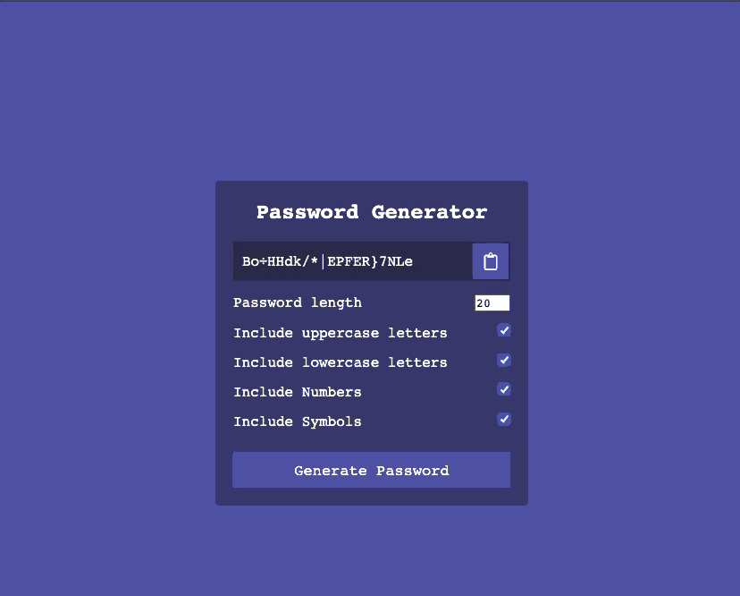

# Password Generator App

In this project, an docker image will be build, The image will be pushed to docker repository and it will deploy it to EKS cluster which was provisioned in AWS using Terraform.

  

Pre-requisite:
--------------
1. Need to have the Kubernates cluster details or the Kube config file which will have all the EKS cluster details.
2. Need to install docker and kubernates continous deploy plugin in Jenkins.
3. Create the creditials of docker registry and for kubernates(Kubeconfig file) in Jenkins credentials.
4. Configire the integration of Jenkins and Github with webhooks for autometic triggers jenkins when there is a code checked in Github.
5. Create a new pipeline job in jenkins and checkmark "GitHub hook trigger for GITScm polling" option under build Trigger sectionn.
6. Under the pipeline section select pipeline script from SCM and configure the settings by providing the git URL and the branch (Master) where the Jenkinsfile is present.
7. Save and apply.
8. Once all the application files required to build docker image and Dockerfile and Jenkinsfile is checked in to the repository the new job in jenkins will get trigger to provision the EKS cluster in AWS

